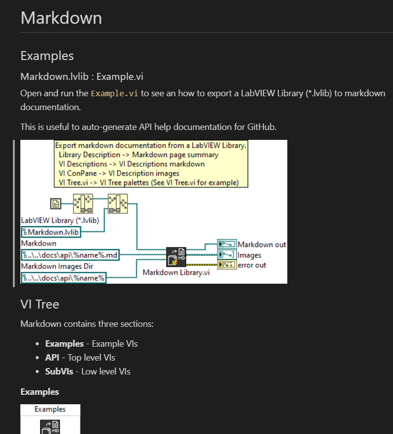
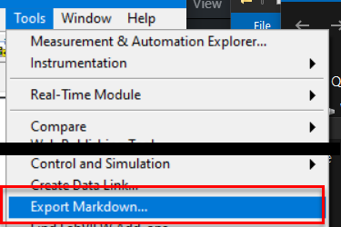

# LabVIEW Markdown
 Markdown generator for LabVIEW Libraries

# Getting Started

Open and run the `src/Example.vi` to see how to
auto-generate markdown help documentation from a LabVIEW Library (\*.lvlib).



# Overview

This library auto-generates markdown documentation from a LabVIEW Library.
Similar to DocStrings in python, this auto-generates API reference documentation by converting
the library and VI connector pane and VI documentation to a markdown (\*.md) file and png images.

See an example of auto-generated documentation here: [/docs/api/markdown.md](/docs/api/markdown.md)

The goal is to auto-generate help files from LabVIEW code compatible with GitHub.

## Tools > Export Markdown...

To make it easier to use this markdown generator, a LabVIEW Tools menu plugin is also provided.

Copy the `builds/Export_Markdown.llb` to `<LabVIEW>\project` to add a **Tools > Export Markdown...** menu item in LabVIEW.

To use, open a LabVIEW project or library and select `Tools > Export Markdown...`. Select the LabVIEW Library (\*.lvlib) to export and press OK.



The markdown documentation and images are exported to the relative path at: `..\..\docs\api\%name%.md`.

## Markdown Template

This library uses an embedded markdown template to generate the documentation.

Markdown template:

```
# <library_name>
<library_description>

## Examples
<example_vi_description>

## VI Tree
<vi_tree_description>
<palettes>

## VI Descriptions
### <VI>
<vi_conpane_image>
<vi_description>
```

### VI Tree - Palettes

In addition to the standard VI documentation, this library also exports the VI Tree SubVI's on the 
block diagram as palettes menu images to better visualize the library's usages.

Refer to the `src/VI Tree.vi` to see an example on how to create different VI Tree palettes
using a square decoration and positioning the SubVIs within the decoration.

The VI Tree diagram auto-generates the following palette images.


Generates palette images...


## Summary

This library helps create markdown API reference documentation for LabVIEW Library VIs.
