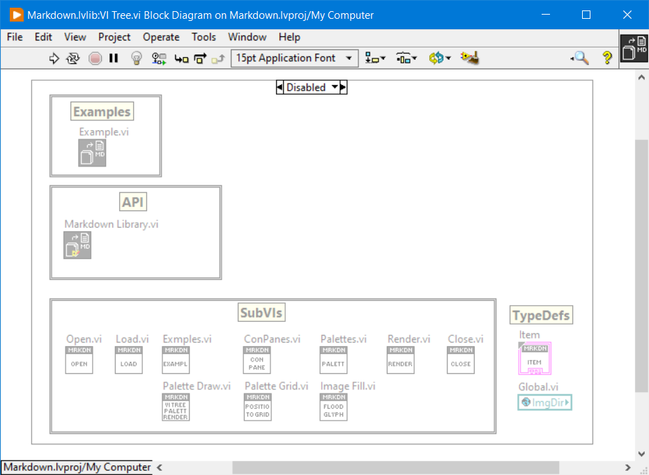
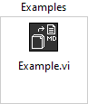
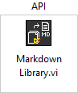
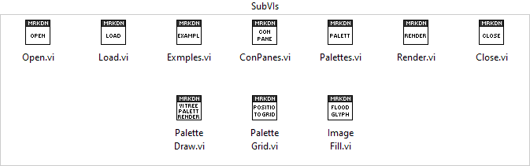

# LabVIEW Markdown
 Markdown generator for LabVIEW Libraries

# Getting Started

Open and run the `src/Example.vi` to see how to export a LabVIEW Library (\*.lvlib) to markdown help documentation.

# Overview

This library auto-generates markdown documentation from a LabVIEW Library.
Similar to DocStrings in python, this auot-generates API reference documentation by converting
the library and VI connector pane and VI documentation to a markdown file and png images.

See an example of auto-generated documentation here: [/docs/api/markdown.md](/docs/api/markdown.md)

The goal to to auto-generate help files from LabVIEW code compatible with GitHub.

## Markdown Template

This library uses an embedded markdown template to generate the documentation.

Markdown template:

```
# <library_name>
<library_description>

## Examples
<example_vi_description>

## VI Tree
<vi_tree_description>
<palettes>

## VI Descriptions
### <VI>
<vi_conpane_image>
<vi_description>
```

### VI Tree - Palettes

In addition to the standard VI documentation, this library also exports the VI Tree SubVI's on the 
block diagram as palettes menu images to better visualize the library's usages.

Refer to the `src/VI Tree.vi` to see an example on how to create different VI Tree palettes
using a square decoration and positioning the SubVIs within the decoration.

The VI Tree diagram auto-generates the palette images.



Generates







