# Markdown


## Examples

### Markdown.lvlib : Example.vi

Open and run the `Example.vi` to see an how to export a LabVIEW Library (*.lvlib) to markdown documentation.

This is useful to autogenerate API help documentation for GitHut.

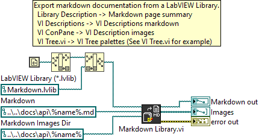


## VI Tree

Markdown contains three sections:
- <b>Examples</b> - Example VIs
- <b>API</b> - Top level VIs
- <b>SubVIs</b> - Low level VIs

**Examples**


**API**


**SubVIs**


## VI Descriptions

**API**

---

### Markdown.lvlib : Markdown Library.vi

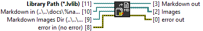

Exports a LabVIEW Library (*.lvlib) to markdown help documentation.

Markdown template:

```
# <library_name>
<library_description>

## Examples
<example_vi_description>

## VI Tree
<vi_tree_description>
<palettes>

## VI Descriptions
### <VI>
<vi_conpane_image>
<vi_description>
```

**SubVIs**

---

### Markdown.lvlib : Close.vi

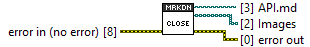

Return the exported markdown and images paths and close the library references.

### Markdown.lvlib : ConPanes.vi

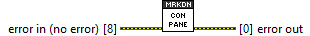

Exports the VI connector pane images.

### Markdown.lvlib : Exmples.vi

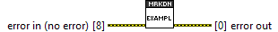

Exports the example VIs (i.e. Starts with "Example*.vi") block diagram images.

### Markdown.lvlib : Global.vi


Markdown global variables. This library uses a global variable to avoid large data flow copies.

### Markdown.lvlib : Image Fill.vi

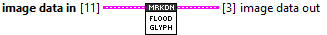

Flood connector pane and icon 24-bit images to mask white (255, 255, 255).

### Markdown.lvlib : Load.vi

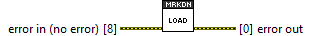

Load the library project references.

### Markdown.lvlib : Open.vi

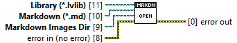

Initialize the markdown generator, resets the global variables and resolves the markdown paths.

Use `%name%` to replace the Library name (without extension) in the output filepaths.

### Markdown.lvlib : Palette Draw.vi

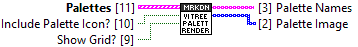

Draw diagram palette images as "text and image".

### Markdown.lvlib : Palette Grid.vi

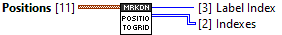

Returns the VI Tree palette positions based on the decorations. This calculates the grid positions by alignment on the VI Tree block dragram.

### Markdown.lvlib : Palettes.vi


Export palette images from the VI Tree SubVI positions on the block diagram. Use a square decoration to create sub-palettes.

### Markdown.lvlib : Render.vi

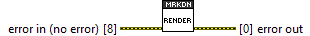

Render the Library markdown.

**TypeDefs**

---

### Markdown.lvlib : Item.ctl

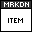

Library item information.


